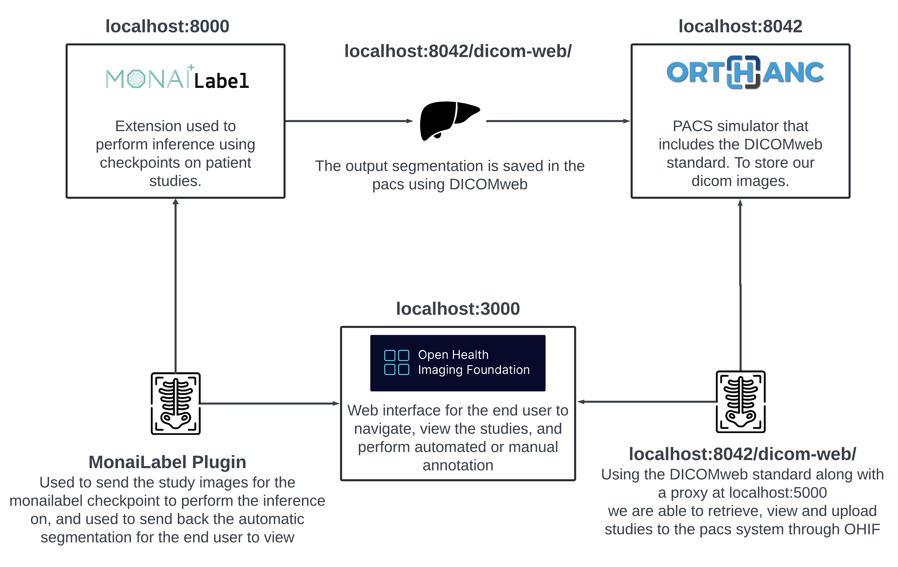

# Setup standalone OHIF with Orthanc and MONAILabel

For more flexibilty and control, you can setup OHIF standalone and connect it to Orthanc and MONAILabel. This setup allows you to run OHIF on your local machine and connect to Orthanc and MONAILabel running on the same machine or on a different machine. While also allowing you to edit and customize the OHIF source code.


## Prerequisites
- [Setup Orthanc and MONAILabel](README.md)
- [Downloaded OHIF source code, met its requirements, and installed its dependencies](https://github.com/OHIF/Viewers?tab=readme-ov-file#requirements)

## Step 1: Install the MONAILabel OHIF Plugin
1. Open a command prompt or terminal and clone the MONAILabel OHIF Plugin repository:
    ```
    git clone https://github.com/Project-MONAI/MONAILabel
    ```
2. Navigate to the directory where you cloned the MONAILabel source code and copy the extensions and modes folders from the following paths respectively:
    - `MONAILabel/plugins/ohifv3/extensions/monai-label` to `OHIF/extensions`
    - `MONAILabel/plugins/ohifv3/modes/monai-label` to `OHIF/modes` 

## Step 2: Linking the MONAILabel OHIF Plugin
1. Navigate to the `OHIF` directory and open a command prompt or terminal.
2. Run the following command to link the MONAILabel OHIF Extension:
    ```
    yarn run cli link-extension "Path_to_your_OHIF_folder\extensions\monai-label"
    ```
3. Run the following command to link the MONAILabel OHIF Mode:
    ```
    yarn run cli link-mode "Path_to_your_OHIF_folder\modes\monai-label"
4. Once linked, you can check if everything is linked correctly by running the following command and checking if MONAILabel is listed:
    ```
    yarn run cli list
    ```

## Step 3: Running OHIF and performing inferences

1. Navigate to the `OHIF` directory and open a command prompt or terminal.
2. Start the MONAILabel and Orthanc servers. (Refer to the [MONAILabel and Orthanc setup](README.md))
2. Run the following command to start the OHIF server:
    ```
    yarn run dev:orthanc
    ```
3. Open a web browser and navigate to `http://localhost:3000/` to access the OHIF app.
